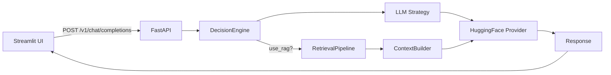

# Automotive RAG Assistant

## Overview
- Streamlit UI with Landing → Chat mode, pill-shaped input, suggestion capsules, language selector (ID/EN).
- FastAPI backend with modular LLM strategies and RAG (Sentence-Transformers + FAISS).
- Strict automotive-only domain with bilingual output, minimum 4 sentences per language.
- Default model: `Qwen/Qwen2.5-0.5B-Instruct` (CPU-friendly generative model).

## Architecture

## Key Rules
- Automotive-only. If non-automotive: refuse with
  - [ID] Maaf, sistem ini hanya mendukung pertanyaan seputar otomotif.
  - [EN] Sorry, this system only supports automotive-related questions.
- Output bilingual in exact format:
  - [ID] … 
  - [EN] …
- Without context: state general knowledge, avoid absolutes; specs may vary by year/market/variant.
- Minimum 4 sentences per language section.

## Endpoints
- POST `/v1/chat/completions`
  - Request: `{ "query": string, "model_id"?: string, "use_rag"?: boolean, "filters"?: object }`
  - Response: `{ "response": string, "sources": [], "latency_ms": number, "trace": object }`
- GET `/health`

## Setup
1. Prerequisites: Docker, Python 3.12
2. Install:
   - `docker compose up -d --build`
3. Run UI:
   - `streamlit run client_ui/app.py`

## Configuration
- Model via env:
  - `DEFAULT_MODEL_ID=Qwen/Qwen2.5-0.5B-Instruct` in docker-compose.yml or Dockerfile.
- Hugging Face token:
  - Do not commit secrets. Set `HF_TOKEN` via environment variable at runtime (e.g., shell or CI secrets).

## Testing
All tests in [tests](file:///Users/tatas/Downloads/fadel/tests):
- `python3 tests/test_backend.py`
- `python3 tests/test_docker_api.py`
- `python3 tests/test_crv.py`
- `python3 tests/test_upload.py`
- `python3 tests/fast_rag_test.py` (mock LLM for fast architecture verification)
- `python3 tests/full_rag_test.py` (E2E RAG, real inference)

## Project Structure
- UI: [client_ui/app.py](file:///Users/tatas/Downloads/fadel/client_ui/app.py), [client_ui/api.py](file:///Users/tatas/Downloads/fadel/client_ui/api.py)
- API: [backend/app/main.py](file:///Users/tatas/Downloads/fadel/backend/app/main.py), [chat endpoints](file:///Users/tatas/Downloads/fadel/backend/app/api/v1/endpoints/chat.py)
- LLM: [providers](file:///Users/tatas/Downloads/fadel/backend/app/llm/providers/hf_provider.py), [strategies](file:///Users/tatas/Downloads/fadel/backend/app/llm/strategies)
- RAG: [retrieval](file:///Users/tatas/Downloads/fadel/backend/app/rag/retrieval), [ingestion](file:///Users/tatas/Downloads/fadel/backend/app/rag/ingestion)
- Schemas: [backend/app/schemas](file:///Users/tatas/Downloads/fadel/backend/app/schemas)

## Notes
- Deberta-v3-base is encoder-only and not compatible with generative chat. Use generative models compatible with `AutoModelForCausalLM`.
- HuggingFace cache persisted with Docker volume to avoid re-downloads.

