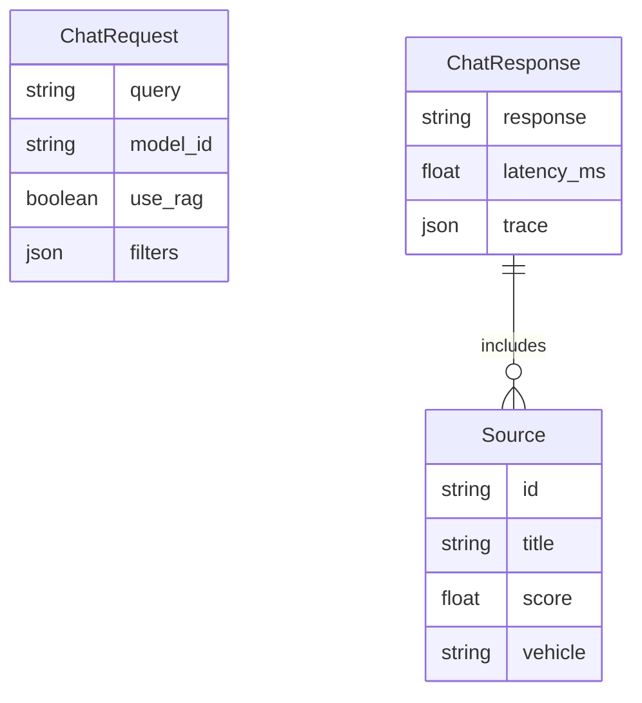
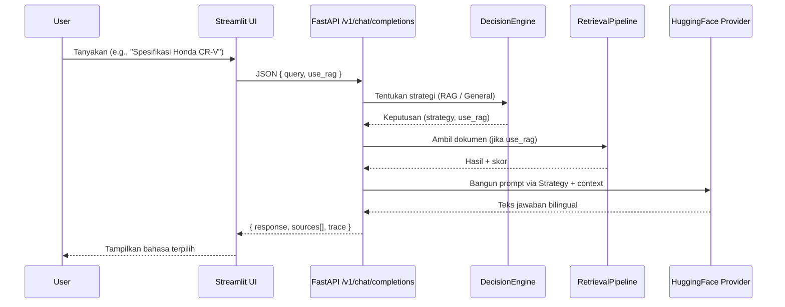

# Dokumentasi Akhir Sistem: Automotive RAG Assistant

## Ringkasan
- UI: Streamlit, mode Landing → Chat, pilihan bahasa ID/EN, kapsul saran, input pill.
- Backend: FastAPI, RAG dengan Sentence-Transformers + FAISS, strategi LLM modular.
- Model: Qwen/Qwen2.5-0.5B-Instruct (generatif, bilingual).
- Aturan ketat otomotif, output bilingual [ID]/[EN], 4+ kalimat per bahasa.

## Arsitektur Sistem (Flow Diagram)
```mermaid
flowchart LR
    UI[Streamlit UI] -->|POST /v1/chat/completions| API[FastAPI]
    API --> DECISION[DecisionEngine]
    DECISION -->|use_rag?| RAG[RetrievalPipeline]
    RAG --> CTX[ContextBuilder]
    DECISION --> STRAT[LLM Strategy Selector]
    STRAT --> LLM[LLM Provider (HuggingFace)]
    CTX --> LLM
    LLM --> RESP[Response Builder]
    RESP --> UI
```

## ERD (Simplifikasi)


## Input/Output Diagram


## Komponen Utama
- UI: [app.py](file:///Users/tatas/Downloads/fadel/client_ui/app.py), [api.py](file:///Users/tatas/Downloads/fadel/client_ui/api.py)
- API: [main.py](file:///Users/tatas/Downloads/fadel/backend/app/main.py), [chat.py](file:///Users/tatas/Downloads/fadel/backend/app/api/v1/endpoints/chat.py)
- RAG: Embedder, Retriever, FAISS Store, Ingestion Pipeline
- LLM: Factory, HF Provider, Strategies (direct_answer, context_aware, reasoning)
- Skema: [schemas/chat.py](file:///Users/tatas/Downloads/fadel/backend/app/schemas/chat.py)

## Aturan Output & Keamanan
- Domain otomotif saja; jika bukan otomotif, wajib menolak dengan pesan standar [ID]/[EN].
- Bilingual selalu; minimal 4 kalimat per bahasa.
- Tanpa konteks: sebut "berdasarkan pengetahuan umum", hindari klaim absolut/official.

## Endpoint Utama
- POST /v1/chat/completions
  - Input: ChatRequest { query, model_id?, use_rag? }
  - Output: ChatResponse { response, sources[], latency_ms, trace }
- GET /health

## Pengujian
- Semua skrip uji disatukan: [tests/](file:///Users/tatas/Downloads/fadel/tests)
  - [test_backend.py](file:///Users/tatas/Downloads/fadel/tests/test_backend.py): tes sederhana endpoint chat.
  - [test_docker_api.py](file:///Users/tatas/Downloads/fadel/tests/test_docker_api.py): tes API dengan health check.
  - [fast_rag_test.py](file:///Users/tatas/Downloads/fadel/tests/fast_rag_test.py): verifikasi alur arsitektur (mock LLM).
  - [full_rag_test.py](file:///Users/tatas/Downloads/fadel/tests/full_rag_test.py): E2E RAG (real inference).

## Konfigurasi Model
- Default: Qwen/Qwen2.5-0.5B-Instruct di [docker-compose.yml](file:///Users/tatas/Downloads/fadel/docker-compose.yml#L7-L15)

## Cara Jalan
1. Jalankan backend: `docker compose up -d --build`
2. Tes cepat: `python3 tests/test_backend.py`
3. Jalankan UI: `streamlit run client_ui/app.py`

## Catatan
- Model generatif wajib (AutoModelForCausalLM). Deberta-v3-base tidak kompatibel untuk chat generatif.
- Cache HuggingFace dipersist dengan volume `hf_cache`.

